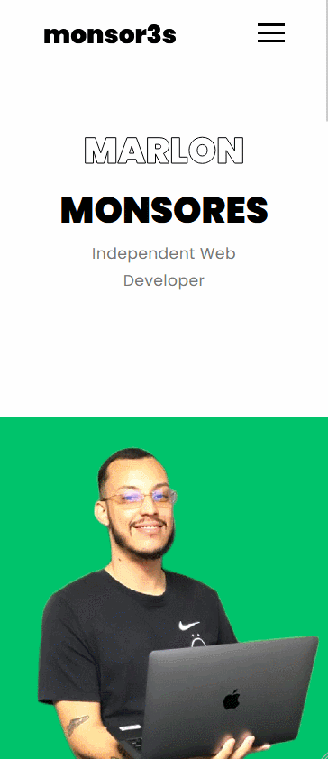

# 💻 Personal Portfolio

<h1 align="center" style="color: #000; font-size:34px; font-weight: 900">
  monsor3s
<h1>

This is my [personal portfolio](https://monsor3s.vercel.app/).

##  🧵 Índice

  - [Screenshot](#📷-screenshot)
  - [Links](#🖇-links)
  - [How to Clone the project](#♻-how-to-clone-the-project)
  - [Built With](#🛠-built-with)
  - [What I've learned](#📝-what-ive-learned)
  - [Autor](#🙋🏻‍♂️-autor) 

### 📷 Screenshots
<div style="display:flex; gap: 20px">
  
  
</div>


### 🖇 Links

- [URL Portfolio](https://monsor3s.vercel.app/)

## ♻ How to clone the project
```bash
  # Clone the project
  $ git clone https://github.com/monsor3s/personal-portfolio.git
```
```bash
  # Enter directory
  $ cd personal-portfolio
```
```bash
  # Install the dependencies, if use npm or yarn
  $ npm install styled-components
  $ yarn add styled-components
```

### 🛠 Built With

- [Design Responsivo](https://developer.mozilla.org/pt-BR/docs/Learn/CSS/CSS_layout/Responsive_Design)
- [Styled-Components](https://styled-components.com/) - For styles
- [React](https://react.dev/)
- [React Icons](https://react-icons.github.io/react-icons)


### 📝 What I've learned

- More learning about the use of useState and useEffect
- Dropdown menu using props

##  🙋🏻‍♂️ Autor

- Linkedln - [@Linkedln](https://www.linkedin.com/in/marlon-monsores-380408b2/)
- Twitter - [@monsor3s](https://twitter.com/monsoresdev)


